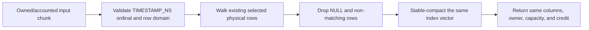

# Exact Timestamp-Range Vector Filter

## Purpose and boundary

Storage pruning answers “can this part or granule possibly contain a match?” The exact timestamp
range filter answers “does this selected row actually match?” Those questions must remain separate:
zone maps are allowed to keep false positives, while a query result is not.

This Phase 9 increment implements exact row truth over one bounded `VectorChunk`. It works equally
with owned columns, lifetime-pinned CSEG backings, and canonical chunks materialized from a mutable
head. It does not combine those sources, lower SQL, resolve row versions, or make a complete tablet
scan claim.

The decision is recorded in
[ADR 0030](../adr/0030-exact-timestamp-range-vector-filtering.md).

## Public interfaces

[`timestamp_range.hpp`](../../include/chronos/query/timestamp_range.hpp) exports:

- `TimestampRangeBound`, one signed nanosecond endpoint plus an inclusive bit; and
- `TimestampRangePredicate`, optional lower/upper bounds with `matches()` and `is_empty()`.

[`vector_chunk.hpp`](../../include/chronos/query/vector_chunk.hpp) adds allocation-free consuming
operations at the selection and chunk layers. [`physical_operator.hpp`](../../include/chronos/query/physical_operator.hpp)
adds the accounted operation and `TimestampRangeFilterOperator`. The factory owns one child, one
column ordinal, and one predicate. [`physical_plan.hpp`](../../include/chronos/query/physical_plan.hpp)
adds `TimestampRangeFilterStage` for reusable shape-checked pipelines.

All objects are pure in-memory query constructs. They add no stable byte representation.

## Predicate semantics

A value matches when it satisfies both present bounds:

```text
lower absent OR value > lower OR (value == lower AND lower inclusive)
AND
upper absent OR value < upper OR (value == upper AND upper inclusive)
```

Endpoints are never adjusted. This matters at the signed domain limits: `(INT64_MIN, …)` and
`(…, INT64_MAX)` are handled by equality plus the inclusive bit, not by overflowing arithmetic.

Reversed bounds are a valid empty range. Equal endpoints match only if both sides are inclusive.
No bounds match every non-NULL timestamp. NULL does not match because a timestamp comparison on
NULL is unknown and a filtering predicate keeps only true.

`TimestampRangePredicate` deliberately lives in the query namespace. The CSEG pruning predicate
has equivalent endpoint fields but a different responsibility. Later lowering must copy endpoint
values and inclusive bits exactly and test the two-stage result against a scalar oracle.

## Data flow and ownership



`VectorSelection` owns a strictly increasing vector of physical row indices. Filtering writes each
kept index into the next output slot and shrinks only the vector size. Because traversal and output
both move forward, input indices are never overwritten before they are read. The ordering and
uniqueness invariants therefore survive without re-sorting.

`VectorChunk` updates logical selection bytes after compaction. Its retained bytes do not shrink:
the index vector retains its capacity and every physical column remains attached. The
`AccountedVectorChunk` carries the same reservation into the result, so query-wide credit cannot be
lost or accidentally transferred to another query.

No byte view escapes the pull. A cell view is consumed while the immutable input chunk is owned by
the operator call. Fixed-width timestamp bytes were validated by `PhysicalColumnView` and are read
as canonical little-endian signed 64-bit bits without alignment-dependent loads.

## Pull lifecycle and failure behavior

`TimestampRangeFilterOperator::next()` follows the existing unary operator contract:

1. sticky end returns immediately;
2. cooperative cancellation is checked before pulling the child;
3. child error requests shared cancellation and propagates unchanged;
4. child end becomes sticky end;
5. a chunk must belong to the supplied `QueryResourceContext`;
6. the timestamp ordinal, type, and physical row domain are validated; and
7. the filtered accounted chunk is returned, even when its selection is empty.

An empty chunk is progress: upstream consumed one physical chunk and later chunks may contain
matches. Treating it as end would truncate the stream. Type/ordinal/shape or ownership violations
return a checked status, release the consumed chunk through RAII, and request cancellation so
siblings stop cooperatively.

Operator construction can fail only for a null child or allocation of the wrapper. A successful
pull performs no allocation. It preserves the input reservation until the downstream chunk owner
is destroyed.

## Physical-plan integration

`PhysicalPipelinePlan::create()` walks stages in order and checks the range ordinal against the
current shape. A prior column subset can therefore make a previously valid ordinal invalid, and a
non-`TIMESTAMP_NS` column is rejected before instantiation.

Instantiation still places the runtime source-shape operator first. A source that claims the plan's
shape but emits another type or nullability fails closed before the range operator interprets a
cell. The filter itself does not change the output column shape, so projection and LIMIT can follow
normally.

## Complexity

For `S` selected input rows, filtering takes `O(S)` time and `O(1)` additional space. It does not
scan unselected physical rows. Retained memory is unchanged; logical selection bytes become
`4 * kept_rows`.

The baseline makes no SIMD, sorted-range, binary-search, or predicate-fusion claim. CSEG ordering or
future head ordering may permit specialized search, but such an optimization must retain exact
NULL/open-bound semantics and must be justified with profiles and differential tests.

## Verification and measurement

Unit tests cover open/closed/unbounded/empty ranges, domain extrema, NULL, sparse selections,
invalid types and shapes, empty-chunk progress, query identity, cancellation, and sticky end. A
deterministic property compares multiple predicates over forced chunk boundaries against scalar
`matches()` evaluation.

The vector fuzzer creates valid nullable timestamp columns, derives missing/open/closed/reversed and
domain-edge bounds from hostile bytes, varies the ordinal, filters, and inspects surviving cells.
The physical-plan fuzzer injects range stages among filter/projection/LIMIT stages. Both run through
the shared sanitizer-enabled fuzz configuration.

`chronos_query_benchmarks` measures dense and sparse selection compaction at 64, 1,024, and 4,096
rows for a half-domain range. It prepares and destroys batches of selections while timing is paused,
then reports examined rows and bytes for the filtering loop. The benchmark isolates the vector
primitive, not scan I/O, planning, source construction, or complete query latency.

## Tradeoffs and next steps

Selection compaction avoids copying but retains columns that may now have very few selected rows.
The generic per-cell path is auditable and safe, though a specialized canonical fixed-width loop may
later be faster. Neither cost justifies weakening exact comparisons or memory ownership.

The aggregate snapshot CSEG factory now performs the first storage integration: it retains the
event-time column, uses identical bounds for conservative Manifest/CSEG pruning and exact filtering,
then removes an unrequested helper column. The mutable-head factory performs the corresponding
exact-only integration after canonical materialization because heads have no zone-map pruning.
Bound-SQL lowering remains separate. Complete part/head composition still requires accepted hidden-
system-column and row-version semantics first.

## Likely review questions

**Why is an unbounded predicate not a no-op?** It still removes NULL, because filtering keeps only
true and comparisons on NULL are unknown.

**Why return an empty chunk?** It records consumed upstream progress; later chunks may match.

**Why not modify the timestamp column?** The result is a row subset, so changing or copying column
bytes would add work and ownership without changing semantics.

**Why keep the same memory charge after most rows are removed?** The index capacity and all columns
are still retained. The original reservation remains a safe conservative charge.

**Can zone maps replace this operator?** No. They prove disjointness only and deliberately admit
false positives in overlapping parts or granules.
